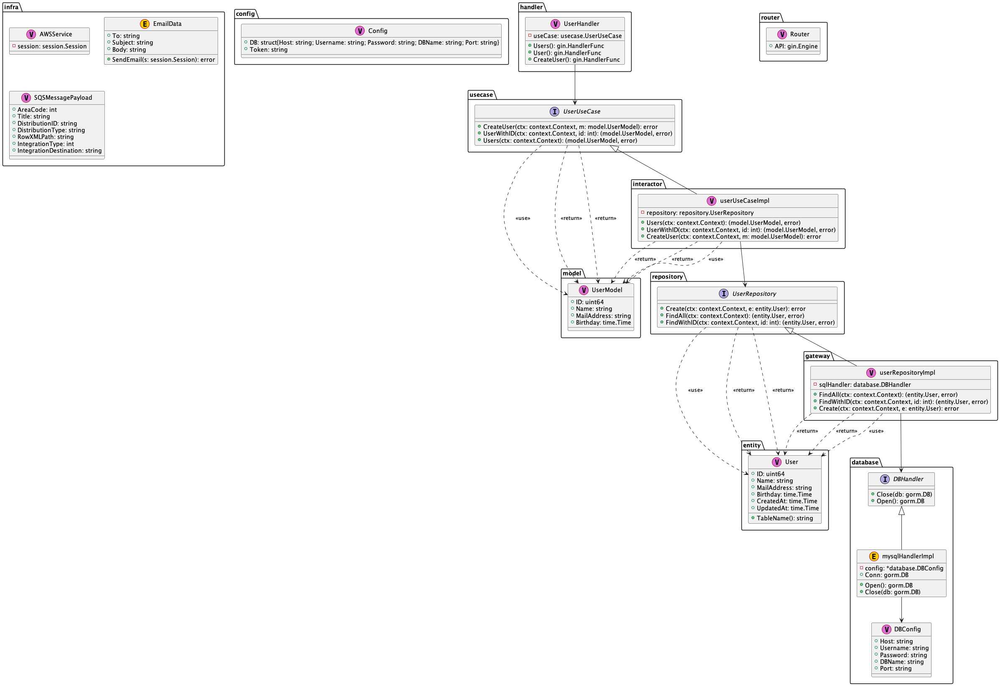

# Go CleanArchitecture Boilerplate



```
├── Makefile
├── README.md
├── application
│   ├── model
│   │   └── user_model.go
│   ├── repository
│   │   └── user_repository.go
│   └── usecase
│       └── user_usecase.go
├── builds
│   └── go
│       └── Dockerfile
├── cmd
│   ├── lambda
│   │   └── lambda.go
│   └── main
│       └── main.go
├── config
│   └── config.go
├── core
│   ├── error_model.go
│   ├── log.go
│   └── time.go
├── di
│   ├── wire.go
│   └── wire_gen.go
├── doc
├── docker-compose.yml
├── domain
│   ├── entity
│   │   └── user.go
│   ├── interactor
│   │   └── user_interactor.go
│   └── validation
│       └── validation.go
├── go.mod
├── go.sum
├── infra
│   ├── aws
│   │   ├── aws.go
│   │   ├── s3.go
│   │   ├── ses.go
│   │   ├── sqs.go
│   │   └── ssm.go
│   ├── database
│   │   ├── database.go
│   │   └── mysql.go
│   └── router
│       └── router.go
├── interfaces
│   ├── gateway
│   │   └── user_repository.go
│   └── handler
│       └── user_handler.go
└── tmp
```